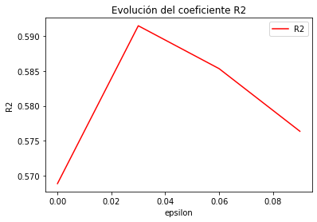

# Modelo Lineal: SVM aplicado a Regresión con Kernel Lineal.

Hemos optado por usar este modelo lineal implementado en la clase `LinearSVR` de `sklearn` usando como función de pérdida la de epsilon_insensitive (que explicaremos más adelante). Una vez entrenado el modelo, como en todos los modelos siguientes, usaremos el coeficiente de determinación $R^2$ para determinar la bondad del ajuste.

Vamos a optar por no utlizar características polinómicas y tampoco reducir la dimensionalidad del problema, ya que no lo vimos oportuno por el poco número de características y por la información que se podía perder. Finalmente comentar que usaremos los datos normalizados y sin Outliers, además haremos una transformación polinómica a la matriz de entrenamiento para añadir características cuadráticas.

## Estimación de Parámetros

**Nota:**Este proceso es costoso computacionalmente hablando, y por esto el código se encuentra comentado, para comprobar los valores que se describen aquí abajo descomentar el código: 


En este modelo solo vamos a estimar el hiperparámetro **epsilon** y **C**, el primero determina la anchura del pasillo en torno al estimador y *C* es el término de regularización, ambos se usan en la función de error (epsilon_insensitive). El resto de parámetros los mantendremos por defecto. Así los resultados que obtenemos son los siguientes: 


Parámetro C: 

El valor por defecto es 1, así que vamos a tomar valores entorno al 1, como son el 0.5, 1, 1.5 y 2. 

Mejores parámetros:  {'C': 0.5}

Con una $R^2$ de:  0.5888467272010589 

Table: Tabla para el parametro C

|Parámetros | $R^2$ medio | Desviación tipica $R^2$| Ranking | tiempo medio ajuste |      
|---|---|---|---|---|    
| C 0.5 | 0.5888 | 0.0141 | 1 | 34.0404|     
| C 1 | 0.5689 | 0.0325 | 2 | 35.6532|     
| C 1.5 | 0.5455 | 0.0289 | 3 | 34.6849|     
| C 2 | 0.5210 | 0.0611 | 4 | 20.8280| 

-----------------------------------------------------


-----------------------------------------------------

Como podemos observar el máximo parece estar antes del 0.5, por eso vamos a probar entre 0.1 y 0.5 con pasos de 0.1: 

Mejores parámetros:  {'C': 0.1}
Con una $R^2$ de:  0.5932866031483144 

Table: Tabla para el parametro C

|Parámetros | $R^2$ medio | Desviación tipica $R^2$| Ranking | tiempo medio ajuste |      
|---|---|---|---|---|    
| C 0.1 | 0.5933 | 0.0152 | 1 | 29.1086|     
| C 0.5 | 0.5888 | 0.0141 | 2 | 25.9276|     
| C 0.2 | 0.5845 | 0.0209 | 3 | 30.6160|     
| C 0.3 | 0.5840 | 0.0189 | 4 | 31.5158|     
| C 0.4 | 0.5722 | 0.0367 | 5 | 31.6116|   

-----------------------------------------------------


-----------------------------------------------------

Así, como podemos ver el máximo se alcanza en 0.1, y será ese el valor que tomemos para C


Pasamos ahora a estudiar el parámetro $\epsilon$:

En primero como el valor por defecto es 0, vamos a tomar estos valores: 0.0,0.1,0.2,0.3.

Mejores parámetros:  {'epsilon': 0.0}
Con una $R^2$ de:  0.56890579922534 

 |Parámetros | $R^2$ medio | Desviación tipica $R^2$| Ranking | tiempo medio ajuste |      
|---|---|---|---|---|    
| epsilon 0.0 | 0.5689 | 0.0325 | 1 | 33.0511|     
| epsilon 0.1 | 0.5607 | 0.0303 | 2 | 24.7232|     
| epsilon 0.2 | 0.3734 | 0.0243 | 3 | 8.7525|     
| epsilon 0.3 | 0.2636 | 0.0410 | 4 | 0.2419|


-----------------------------------------------------


-----------------------------------------------------

Como vemos la gráfica es decreciente, lo que nos hace pensar que para este modelo lo mejor es que el pasillo sea prácticamente con $\epsilon=0$. No obstante vamos a probar con algunos valores entre 0 y 0.1, como son 0.03,0.06 y 0.09: 

Mejores parámetros:  {'epsilon': 0.03}

Con una $R^2$ de:  0.5914477460146103 

Table: Parámetro $\epsilon$

|Parámetros | $R^2$ medio | Desviación tipica $R^2$| Ranking | tiempo medio ajuste |      
|---|---|---|---|---|    
| epsilon 0.03 | 0.5914 | 0.0151 | 1 | 35.6540|     
| epsilon 0.06 | 0.5853 | 0.0220 | 2 | 35.3626|     
| epsilon 0.09 | 0.5764 | 0.0213 | 3 | 18.8831|     
| epsilon 0.0 | 0.5689 | 0.0325 | 4 | 34.6573|


-----------------------------------------------------


-----------------------------------------------------

Como vemos, el máximo se alcanza en $\epsilon =0.03$ luego este será el valor que usemos para nuestro modelo. Tras esto aplicamos nuestro modelo al conjunto de datos de test obteniendo los siguientes resultados: 

```
------------------------------------------------------------
 Evaluando SVM aplicado a Regresión
------------------------------------------------------------
E_in en entrenamiento:  0.6872076565729107
E_test en validación:  0.6252723796692914
```

## Función Pérdida y Regularización

En nuestro caso, el objetivo es minimizar el siguiente problema primal: 

-----------------------------------------------------


-----------------------------------------------------

como hemos comentado, solo computan aquellos errores fuera del pasillo marcado por $\epsilon$, y C es el término de regularización. En nuestro caso C=0.1 y $\epsilon=0.03$.