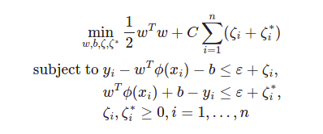

# SVM 

En este apartado vamos a explicar el proceso que hemos seguido para obtener el modelo que usaremos para nuestro problema con SVM. Dado que nuestro problema es de regresión, usaremos la variante de regresión de sklearn denominada **SVR** (Support Vector Regression) de `sklearn.svm`).

En nuestro caso vamos a considerar las siguientes clases de hipótesis: 

## Necesidad de la normalización de los datos e interés de la técnica usada

En este caso, sabemos que el SVM es sensible al escalado de los datos, pues la en la función de regresión que obtengamos aquellos atributos con mayor ecala tendrán una mayor influencia en la elección del estimador, y es por eso que se recomienda (como podemos ver en la documentación) que los datos se encuentren normalizados o estandarizados. Es por eso que para este modelo concreto utilizaremos los datos estandarizados con StandardScaler() de sklearn.

Además compararemos el comportamiento del modelo en datos con Outliers y datos sin Outliers.

## Interés y justificación de la función/es de pérdida usada.

En este caso se pretende resolver el siguiente problema primal:

Dados los vectores de entrenamiento $x_i \in \mathbb{R}^p, i=1,...,n$ y el vector $y \in \mathbb{R}^n$ y $\epsilon>0$, se pretende minimizar: 

Dónde $\epsilon$ sería el ancho del pasillo de regresión (explicarlo  de https://scikit-learn.org/stable/modules/svm.html#kernel-functions)

Problema dual: 

