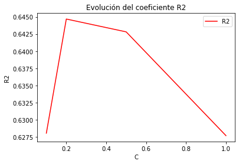
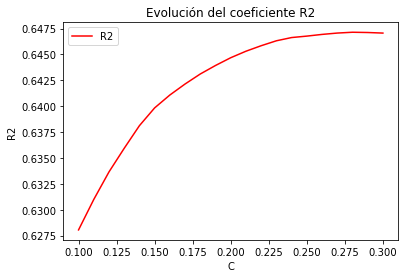
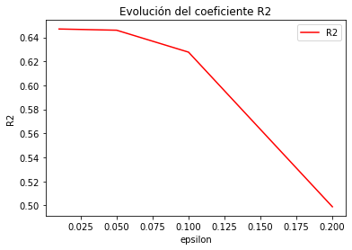
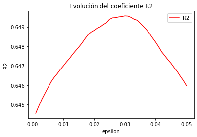

# SVM 

En este apartado vamos a explicar el proceso que hemos seguido para obtener el modelo que usaremos para nuestro problema con SVM. Dado que nuestro problema es de regresión, usaremos la variante de regresión de sklearn denominada **SVR** (Support Vector Regression) de `sklearn.svm`).

En nuestro problema vamos a utilizar el kernel polinómico y el kernel RBF que se nos proporcionan en la clase SVR. De acuerdo con el criterio de la Navaja de Okham vamos a considerar de grado 2 los polinomios para tratar de no sobreajustar los datos y reducir la variabilidad.


## Necesidad de la normalización de los datos e interés de la técnica usada

En este caso, sabemos que el SVM es sensible al escalado de los datos, pues la en la función de regresión que obtengamos aquellos atributos con mayor ecala tendrán una mayor influencia en la elección del estimador, y es por eso que se recomienda (como podemos ver en la documentación) que los datos se encuentren normalizados o estandarizados. Es por eso que para este modelo concreto utilizaremos los datos estandarizados con StandardScaler() de sklearn.

Además compararemos el comportamiento del modelo en datos con Outliers y datos sin Outliers.


## Estimación de parámetros

En un primer lugar vamos a decidir si usar el conjunto de entrenamiento con Outliers o sin Outliers y si usamos kernel polinómico o RBF, para eso vamos a usar cross-validation con los parámetros que nos proporciona la función SVR por defecto, y vemos lo siguiente:

Para Kernel polinómico:

```
Primer Modelo: SVM aplicado a Regresión con kernel polinómico

Ya se ha terminado el croosValidation
Procesamos a ver los mejores estimadores: 
Mejores parámetros:  {'degree': 2}
Con una $R^2$ de:  0.46957304265251754 

Ajustamos ahora con Outliers
Ya se ha terminado el croosValidation
Procesamos a ver los mejores estimadores: 
Mejores parámetros:  {'degree': 2}
Con una $R^2$ de:  0.5205787692040945    
```

Para Kernel RBF: 
```
Segundo Modelo: SVM aplicado a Regresión con kernel RBF

Ya se ha terminado el croosValidation
Procesamos a ver los mejores estimadores: 
Mejores parámetros:  {'degree': 2}
Con una $R^2$ de:  0.5736244354266156 


Ajustamos ahora con Outliers
Ya se ha terminado el croosValidation
Procesamos a ver los mejores estimadores: 
Mejores parámetros:  {'degree': 2}
Con una $R^2$ de:  0.6276937285564042 
```

Como obtenemos mejores resultados para SVR con Kernel RBF vamos a estimar los parámetros para este modelo. Además como con Outliers se obtienen mejores resultados vamos a usar los datos de entrenamiento normalizados y con Outliers.


Como podemos ver en la documentación de sklearn, tenemos multitud de hiperparámetros que poder ajustar, pero nosotros únicamente vamos a estimar los mejores valores de **gamma**, **C** y **epsilon**.

Empezamos estimando el mejor valor de *gamma* que es el coeficiente del kernel: 

$$exp(-\gamma ||x-x'||^2)$$

Los posibles valores que tiene son: 'scale' y 'auto'. Con el *gamma*=scale utiliza como valor de $\gamma$ 1/(n_features X.var()) dónde n_features son la cantidad de características (en nuestro caso 100) y X.var() la varianza del conjunto de entrenamiento. Con el valor *gamma*=auto, se establece el valor 1/n_features.

Los resultados obtenidos fueron los siguientes:
Mejores parámetros:  {'gamma': 'scale'}

Con una $R^2$ de:  0.6276937285564042 

Table: Estimación de $\gamma$

|Parámetros | $R^2$ medio | Desviación tipica $R^2$| Ranking | tiempo medio ajuste |      
|---|---|---|---|---|    
| gamma scale | 0.6277 | 0.0195 | 1 | 0.1807|     
| gamma auto | 0.6275 | 0.0189 | 2 | 0.1556|     

Donde vemos que el mejor valor de gamma es 'scale'. A modo de comentario, los valores de ambos gammas son tan parecidos pues las datos están normalizados y X.var() es prácticamente 1.

En segundo lugar pasamos a la estimación de *C*:

*C* es el parámetro de regularización y por defecto vale 1. La penalización que se usa por defecto en sklearn es l2.

Para estimar C vamos a considerar en primer lugar los posibles valores 0.1, 0.2, 0.5 y 1, obteniendo los siguientes resultados:

-------------------------------------------------


-------------------------------------------------

Mejores parámetros:  {'C': 0.2}

Con una $R^2$ de:  0.644681778040251 

Table: Estimación de C

|Parámetros | $R^2$ medio | Desviación tipica $R^2$| Ranking | tiempo medio ajuste |      
|---|---|---|---|---|    
| C 0.2 | 0.6447 | 0.0211 | 1 | 0.1219|     
| C 0.5 | 0.6428 | 0.0225 | 2 | 0.1417|     
| C 0.1 | 0.6280 | 0.0172 | 3 | 0.1161|     
| C 1 | 0.6277 | 0.0195 | 4 | 0.1108|  

Como vemos, obtenemos el mejor valor para C=0.2, así que como intuimos que el máximo está entre 0.1 y 0.3 vamos a ir en este intervalo dando pasos de 0.01: 

-------------------------------------------------


-------------------------------------------------

Mejores parámetros:  {'C': 0.2799999999999999}

Con una $R^2$ de:  0.6471432200059939 

Table: Estimación de C

|Parámetros | $R^2$ medio | Desviación tipica $R^2$| Ranking | tiempo medio ajuste |      
|---|---|---|---|---|    
| C 0.2799999999999999 | 0.6471 | 0.0220 | 1 | 0.1246|     
| C 0.2899999999999999 | 0.6471 | 0.0221 | 2 | 0.1225|     
| C 0.2699999999999999 | 0.6471 | 0.0220 | 3 | 0.1243|     
| C 0.29999999999999993 | 0.6471 | 0.0223 | 4 | 0.1085|     
| C 0.2599999999999999 | 0.6469 | 0.0219 | 5 | 0.1261|     
| C 0.24999999999999992 | 0.6468 | 0.0218 | 6 | 0.1565|     
| C 0.23999999999999994 | 0.6466 | 0.0217 | 7 | 0.1330|     
| C 0.22999999999999995 | 0.6463 | 0.0217 | 8 | 0.1273|     
| C 0.21999999999999995 | 0.6458 | 0.0216 | 9 | 0.1539|     
| C 0.20999999999999996 | 0.6453 | 0.0214 | 10 | 0.1432|     
| C 0.19999999999999996 | 0.6447 | 0.0211 | 11 | 0.1410|     
| C 0.18999999999999995 | 0.6439 | 0.0208 | 12 | 0.1476|     
| C 0.17999999999999997 | 0.6431 | 0.0204 | 13 | 0.1181|     
| C 0.16999999999999998 | 0.6421 | 0.0199 | 14 | 0.1177|     
| C 0.15999999999999998 | 0.6411 | 0.0195 | 15 | 0.1205|     
| C 0.14999999999999997 | 0.6398 | 0.0191 | 16 | 0.1200|     
| C 0.13999999999999999 | 0.6381 | 0.0188 | 17 | 0.1175|     
| C 0.13 | 0.6359 | 0.0184 | 18 | 0.1168|     
| C 0.12 | 0.6337 | 0.0181 | 19 | 0.1147|     
| C 0.11 | 0.6310 | 0.0177 | 20 | 0.1172|     
| C 0.1 | 0.6280 | 0.0172 | 21 | 0.1266|

Como vemos obtenemos el valor máximo para 0.28 y a partir de ahí el coeficiente R^2 vuelve a decrecer, luego tomamos ese valor como el máximo.

Finalmente estimamos el valor de *epsilon* que intuitivamente es la anchura del pasillo de regresión que usaremos, de manera que los datos dentro de ese pasillo no computan para el error. El valor por defecto es 0.1, luego tomaremos valores en torno a este número.

En primer lugar probamos los valores: 0.01,0.05,0.1 y 0.2.

-------------------------------------------------


-------------------------------------------------


Mejores parámetros:  {'epsilon': 0.01}

Con una $R^2$ de:  0.6469918606397268 

Table: Estimación de $\epsilon$

|Parámetros | $R^2$ medio | Desviación tipica $R^2$| Ranking | tiempo medio ajuste |      
|---|---|---|---|---|    
| epsilon 0.01 | 0.6470 | 0.0285 | 1 | 0.3872|     
| epsilon 0.05 | 0.6460 | 0.0265 | 2 | 0.2255|     
| epsilon 0.1 | 0.6277 | 0.0195 | 3 | 0.1399|     
| epsilon 0.2 | 0.4989 | 0.0194 | 4 | 0.0722|    

Como el mejor valor es el más pequeño de todos, ahora tomamos valores entre 0.001 y 0.05 con paso de 0.001: 

-------------------------------------------------


-------------------------------------------------

Mejores parámetros:  {'epsilon': 0.030000000000000002}

Con una $R^2$ de:  0.6495670733775752 

Y como vemos el máximo lo alcanza en 0.03, luego establecemos ese valor para épsilon. 

Una vez establecidos los parámetros entrenamos el modelo con los datos de entrenamiento y lo probamos en test: 

```
------------------------------------------------------------
 Evaluando SVR con Kernel rbf
------------------------------------------------------------
E_in en entrenamiento:  0.7004154356461222
E_test en test:  0.494754698269274
```

## Interés y justificación de la función/es de pérdida usada.

En este caso se pretende resolver el siguiente **problema primal**:

Dados los vectores de entrenamiento $x_i \in \mathbb{R}^p, i=1,...,n$ y el vector $y \in \mathbb{R}^n$ y $\epsilon>0$, se pretende minimizar: 

------------------------------------------------------------


------------------------------------------------------------

Dónde $\epsilon$ sería el ancho del pasillo de regresión y por lo tanto minimizamos el error que producen aquellos elementos del conjunto de datos que se encuentran a una distancia mayor o igual que $\epsilon$ del estimador. Estos datos penalizan el objetivo con $\zeta_i$ o $\zeta_i^*$ dependiendo de si están por encima o por debajo del tubo que genera $\epsilon$.

Problema dual: 
El problema dual equivalente es el siguiente

------------------------------------------------------------


------------------------------------------------------------

Dónde $e$ sería un vector de unos, $Q$ una matriz cuadrada semidefinida positiva, dónde $Q_{ij}\equiv K(x_i,x_j)=\Phi(x_i)^T\Phi(x_j)$ es el kernel. Aquí los vectores se mapean a un espacio de mayor dimensionalidad por medio de la función $\Phi$.
