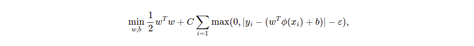

\newpage  

# Communities and Crime Data Set 


## Consideraciones previas  

- Para ejecutar el problema la estructura de fichero debe de ser la siguiente:  
```
|- main.py
|- datos
    |-- communities.data

```

- Todos los tiempos que se muestren estarán en segundos.
- Las prestaciones del equipo en que han sido medidas son:   
    - Procesador Intel core i5 de las séptima generación.  
    - 8 gigas de ram.  


Los datos han sido obtenidos de     

https://archive.ics.uci.edu/ml/datasets/communities+and+crime


## Descripción del problema   

Estamos ante un problema de regresión (aprendizaje supervisado) donde 
se pretende determinar el número total de crímenes violentos por cada $10^5$ habitantes  

 Esta vez se trata de 1994 instancias que recogen información diversa (raza, renta per cápita, divorciados...) sobre la población de regiones de Estados Unidos, 
  
Los datos que nos da están normalizado, por lo que consideramos la matriz de característica $\mathcal X = [0, 1]^{122}$,
el vector de etiquetas $\mathcal Y = [0, 1]$
y queremos aprender una función $f:\mathcal X \to \mathcal Y$ que asigne a cada ejemplo la cantidad (normalizada) de crímenes violentos que se producen por cada $100.000$ habitantes.


### Enfoque elegido para resolver el problema  

- Preprocesado de datos (eliminar tributos perdidos, quitar outliers, normalización).  
- Intento de resolución mediante modelo lineal. 
- E intentamos modelos no lineales (SVM, random forest, boosting, MLP).

## Interés de la variable  

Las etiquetas aportadas son en total 122 predictivas, 5 no predictivas (state, country, community, communityname y fold) y una objetivo (ViolentCrimesPerPop).  Para leerlas de forma explícita consultar [Attribute Information del apéndice](#attribute-information).  


Buscando los mejores hiperparámetros.  

## Codificación de los datos de entrada  

Para leer los datos nos enfrentamos a dos problemas:  

- Existencia de atributos nominales y no predictivos.  
- Hay pérdida de datos.  

### Atributos no predictivos y nominales  


Atendiendo a [Attribute Information](#attribute-information) tenemos que los cinco primeros atributos son no predictivos, luego los eliminamos directamente en el programa de las prácticas.  

El resto de valores son decimales, luego los procesamos sin problema.   


<!--Categorías: https://www.kdnuggets.com/2021/05/deal-with-categorical-data-machine-learning.html -->

### Pérdida de datos  

Como se indica en la documentación hay datos perdidos, cierta cantidad de datos perdidos en un mismo atributo da lugar a que esta sea de poca utilidad. 

Aplicamos el criterio dado en el guión, eliminamos los atributos que tengan una pérdida mayor o igual del $20\%$, para el resto los completamos con la media de valores válidos de ese atributo más un valor aleatorio dentro del intervalo $[-1.5 \sigma, 1.5 \sigma ]$ siendo $\sigma$ la desviación típica de la variable dicha.  

Todo esto se implementa en nuestra función `TratamientoDatosPerdidos(x, porcentaje_eliminacion = 20)`.  

## Separación test y entrenamiento  

Utilizamos la separación clásica: $20\%$ de los datos para test y el resto para entrenamiento , ya que el tamaño de muestra 1994 los consideramos suficiente.  Antes de hacer la separación se han desordenado los datos y a partir de ahora solo se trabajará con los datos del conjunto de entrenamiento.  


## Eliminación de valores atípicos  

Vamos conservar los datos dentro de un intervalo de confianza del 0.997, para eliminar posibles ruidos.  

La función utilizada para esto ha sido   

```python
def EliminaOutliers(y, proporcion_distancia_desviacion_tipica = 3.0):
    '''
    OUTPUT
    (muestra en pantalla alguna información sobre el cálculo de la máscara)
    mascara_y_sin_outliers
    INPUT
    y: etiquetas a las que quitar el outliers

    proporcion_distancia_desviacion_tipica = 3.0
   
    Información sobre cómo elegir la proporcion_distancia_desviacion_tipica:
    Alguna relaciones: 
    distancia | intervalo de confianza:
    1         | 0.683
    1.282     | 0.8
    1.644     | 0.9
    2         | 0.954
    3         | 0.997
    3.090     | 0.998
    4         | 0.9999367
    5         | 0.99999942
    '''
```

## Normalizamos los datos  

Nos dicen que todos los datos están normalizados al intervalo $[0, 1]$, pero por preprocesados anteriores como haber eliminado outliers es necesario 
tipificar.  

El interés de esto es que algunos de los modelos utilizados son sensibles al escalado de los datos y se recomienda en su documentación normalizarlos primero.  

Existen diferentes métodos de transformación (z-score, min-max, logística...), nosotros hemos optado por el Z-score. [@tificiacionMicrosoft] Que consiste en una transformación de la variable aleatoria $X$ a otra, $Z$ de media cero y varianza uno. $$Z = \frac{ x - \bar{x}}{\sigma}$$

Donde $\bar x$ representa la media de $X$ y $\sigma$ la desviación típica.

Para la implementación utilizamos la función StandardScaler() y los métodos fit_transform( x_train ) y scaler.transform( x_test). [@StandardScaler]

La necesidad de estos método es normalizar a partir de los datos de entrenamiento, guardar la media y varianza de estos datos y luego aplicar la misma transformación (con los mismo datos de entrenamiento) al test, esto se realiza así ya que si se aplicara la transformación a todos los datos se estaría cometiendo data snopping.  

## Reducción de dimensión PAC  

Las ventajas que nos puede aplicar una reducción PAC es a nivel computacional o para poder visualizar los datos. Puesto que nuestro data set es de tamaño razonable no consideramos conveniente su utilización ya que solo nos restaría en bondad del ajuste.  

Tampoco creemos que nos vaya a aportar ninguna ventaja la visualización de los datos por T-SNE, es por ello que prescindimos de ella también.  

### Procesado aplicado a los datos  

Acabamos el preprocesado con los siguientes posibilidades para conjunto de entrenamiento:   

- `x_train` : Sin outliers, normalizado.
- `x_train_sin_normalizado`: sin outliers, normalizado.   
- `x_train_outliers_normalizado`: con outliers, normalizado.  
- `x_train_con_outliers`: con outliers, sin normalizar.  

Si nos fijamos en la dimensión de la matriz de características x dependiendo de la transformación utilizada podemos observar lo siguiente: 

Table: Dimensiones obtenidas en X tras preprocesado de los datos  
 
| Datos                  | dimensión   |
| ---                    | ---         |
| `x_train`              | (1556, 100) |
| `x_train_con_outliers` | (1595, 100) |


Como podemos observar, de las 122 características posibles que tenía nuestra matriz x de entrenamiento en un principio, como 5 no son predictivos y la última columna son las etiquetas correspondientes a cada fila, el conjunto de atributos se nos queda en 116. Después, tras la gestión de atributos perdidos se eliminaron 16 atributos (pues tenían más de un 20% de valores perdidos), quedándose así un total de 100 características que utilizaremos para entrenar nuestros modelos.

Por otra parte, en el proceso de eliminar outliers (como se puede ver en el número de filas) se eliminan un total de 39 filas.  


- SVM con kernel lineal  
- Random forest  
-  


## Métrica de error  

Para este problema vamos a utilizar el coeficiente de determinación $R^2$ para analizar la bondad de un ajuste. 

El motivo principal es que se encuentra acotado en el intervalo $[0,1]$ siendo uno el mejor ajuste posible.  

Esta métrica se calcula de la siguiente manera:  

$$R^2 (y, \hat{y}) = 1 - \frac{ \sum_{i=1}^{n} (y_i - \hat{y_i})^2}{ \sum_{i=1}^{n} (y_i - \bar{y})^2}$$  

Donde $\bar{y} = \frac{1}{n} \sum_{i=1}^{n} y_i$  

Cabe destacar que aunque teóricamente el valor está acotado, por le método de cálculo de la propia biblioteca
de scikit learn, existen caso en que es arbitrariamente peor.  En estos casos nosotros hemos optado por plasmar 
ese cálculo negativo en la memoria, pero a nivel teórico se considerará que el modelo no explica nada, es decir 
que $R^2 = 0$.  


\newpage   

# Modelo Lineal: SVM aplicado a Regresión con Kernel Lineal.

Hemos optado por usar este modelo lineal implementado en la clase `LinearSVR` de `sklearn` usando como función de pérdida la de epsilon_insensitive (que explicaremos más adelante). Una vez entrenado el modelo, como en todos los modelos siguientes, usaremos el coeficiente de determinación $R^2$ para determinar la bondad del ajuste.

No vamos reducir la dimensionalidad del problema, ya que no lo vimos oportuno por el poco número de características y por la información que se podía perder. Finalmente comentar que usaremos los datos normalizados y sin Outliers, además haremos una transformación polinómica a la matriz de entrenamiento para añadir características cuadráticas.

## Estimación de Parámetros

**Nota:**Este proceso es costoso computacionalmente hablando, y por esto el código se encuentra comentado, para comprobar los valores que se describen aquí abajo descomentar el código: 


En este modelo solo vamos a estimar el hiperparámetro **epsilon** y **C**, el primero determina la anchura del pasillo en torno al estimador y *C* es el término de regularización, ambos se usan en la función de error (epsilon_insensitive). El resto de parámetros los mantendremos por defecto. Así los resultados que obtenemos son los siguientes: 


Parámetro C: 

El valor por defecto es 1, así que vamos a tomar valores entorno al 1, como son el 0.5, 1, 1.5 y 2. 

Mejores parámetros:  {'C': 0.5}

Con una $R^2$ de:  0.5888467272010589 

Table: Tabla para el parámetro C

| Parámetros | $R^2$ medio | Ranking | tiempo medio ajuste |
|------------|-------------|---------|---------------------|
| C 0.5      | 0.5888      | 1       | 34.0404             |
| C 1        | 0.5689      | 2       | 35.6532             |
| C 1.5      | 0.5455      | 3       | 34.6849             |
| C 2        | 0.5210      | 4       | 20.8280             |

-----------------------------------------------------


-----------------------------------------------------

Como podemos observar el máximo parece estar antes del 0.5, por eso vamos a probar entre 0.1 y 0.5 con pasos de 0.1: 

Mejores parámetros:  {'C': 0.1}
Con una $R^2$ de:  0.5932866031483144 

Table: Tabla para el parámetro C

| Parámetros | $R^2$ medio | Ranking | tiempo medio ajuste |
|------------|-------------|---------|---------------------|
| C 0.1      | 0.5933      | 1       | 29.1086             |
| C 0.5      | 0.5888      | 2       | 25.9276             |
| C 0.2      | 0.5845      | 3       | 30.6160             |
| C 0.3      | 0.5840      | 4       | 31.5158             |
| C 0.4      | 0.5722      | 5       | 31.6116             |

-----------------------------------------------------


-----------------------------------------------------

Así, como podemos ver el máximo se alcanza en 0.1, y será ese el valor que tomemos para C


Pasamos ahora a estudiar el parámetro $\epsilon$:

En primero como el valor por defecto es 0, vamos a tomar estos valores: 0.0,0.1,0.2,0.3.

Mejores parámetros:  {'epsilon': 0.0}
Con una $R^2$ de:  0.56890579922534 

 | Parámetros  | $R^2$ medio | Ranking | tiempo medio ajuste |
 |-------------|-------------|---------|---------------------|
 | epsilon 0.0 | 0.5689      | 1       | 33.0511             |
 | epsilon 0.1 | 0.5607      | 2       | 24.7232             |
 | epsilon 0.2 | 0.3734      | 3       | 8.7525              |
 | epsilon 0.3 | 0.2636      | 4       | 0.2419              |


-----------------------------------------------------


-----------------------------------------------------

Como vemos la gráfica es decreciente, lo que nos hace pensar que para este modelo lo mejor es que el pasillo sea prácticamente con $\epsilon=0$. No obstante vamos a probar con algunos valores entre 0 y 0.1, como son 0.03,0.06 y 0.09: 

Mejores parámetros:  {'epsilon': 0.03}

Con una $R^2$ de:  0.5914477460146103 

Table: Parámetro $\epsilon$

| Parámetros   | $R^2$ medio | Ranking | tiempo medio ajuste |
|--------------|-------------|---------|---------------------|
| epsilon 0.03 | 0.5914      | 1       | 35.6540             |
| epsilon 0.06 | 0.5853      | 2       | 35.3626             |
| epsilon 0.09 | 0.5764      | 3       | 18.8831             |
| epsilon 0.0  | 0.5689      | 4       | 34.6573             |


-----------------------------------------------------


-----------------------------------------------------

Como vemos, el máximo se alcanza en $\epsilon =0.03$ luego este será el valor que usemos para nuestro modelo. Tras esto aplicamos nuestro modelo al conjunto de datos de test obteniendo los siguientes resultados: 

```
------------------------------------------------------------
 Evaluando SVM aplicado a Regresión
------------------------------------------------------------
E_in en entrenamiento:  0.6872076565729107
E_test en validación:  0.6252723796692914
```

## Función Pérdida y Regularización

En nuestro caso, el objetivo es minimizar el siguiente problema primal: 

-----------------------------------------------------


-----------------------------------------------------

como hemos comentado, solo computan aquellos errores fuera del pasillo marcado por $\epsilon$, y C es el término de regularización.

Los mejores hiperparámetros encontrados han sido
caso C=0.1 y $\epsilon=0.03$.  


\newpage

# Random Forest

En el modelo Random Forest se construyen  `n_estimators` árboles de decisión usando la totalidad de la muestra para la construcción de cada uno, pero sólo un subconjunto de las caracterı́sticas para disminuir la correlación entre los árboles. Vamos a usar, tal y como se vió en teoría,  la raı́z cuadrada del número de caracterı́sticas, ya que la propia función de sklearn lo recomienda y porque empíricamente se sabe que esa cantidad da unos buenos resultados. Después de esto, se hace la media de los árboles obtenidos para evitar el overfitting y reducir la variabilidad.

Hemos optado por este modelo por su capacidad para lograr un bajo sesgo y una baja variabilidad (aunque para esto tendremos que usar regularización, como se explicará más adelante).

Los conjuntos de datos que usaremos serán los de entrenamiento estandarizados con y sin Outliers.

### Estimación de parámetros
 
 La función de `sklearn.ensemble` que usaremos es `RandomForestRegressor`, y como podemos observar esta función dispone de múltiples hiperparámetros para modificar (profundidad máxima de cada árbol, máximo número de
nodos terminales, mı́nimo número de muestras en cada nodo, . . .) pero de todos estos hiperparámetros sólo nos centraremos en uno: **n_estimators**. Éste nos permite controlar el número de árboles que usaremos para entrenar los datos. El resto de estimadores los tomamos por defecto.

En primer lugar, probamos a usar los datos de entrenamiento estandarizados con y sin Outliers, obteniendo un mejor error de validación cruzada en los datos con Outliers (0.6317frente a 0.6746), por lo que a partir de ahora serán los que usemos para afinar el modelo.

Para elegir un valor de `n_estimators`, representamos el coeficiente de determinación $R^2$ usando validación cruzada con diferentes valores de éste parámetro entre 50 y 300, obteniendo los siguientes resultados   

-------------------------------------------------


-------------------------------------------------


Mejores parámetros:  {'max_features': 'sqrt', 'n_estimators': 300}

Con una $R^2$ de:  0.6317213836930409 

Table: Tabla de parámetros usados

| Parámetros                         | $R^2$ medio | Ranking | tiempo medio ajuste |
|------------------------------------|-------------|---------|---------------------|
| max_features sqrt n_estimators 300 | 0.6317      | 1       | 2.2426              |
| max_features sqrt n_estimators 150 | 0.6307      | 2       | 1.2035              |
| max_features sqrt n_estimators 250 | 0.6307      | 3       | 2.0007              |
| max_features sqrt n_estimators 200 | 0.6298      | 4       | 1.6041              |
| max_features sqrt n_estimators 100 | 0.6288      | 5       | 0.7928              |
| max_features sqrt n_estimators 50  | 0.6248      | 6       | 0.4569              |

Observamos que $R^2$ es creciente a medida que aumentan los árboles del bosque, pero dicho aumento conlleva también un mayor coste computacional, y es por eso que nos preguntamos si merece la pena usar un número muy elevado de árboles. Además como podemos ver en el gráfico anterior, entre 200 y 300 parece que la curva crece mucho más lentamente, por eso vamos a tomar nuevas mediciones entre 200 y 300 de 25 en 25 obteniendo lo siguiente: 

-------------------------------------------------


-------------------------------------------------

Mejores parámetros:  {'max_features': 'sqrt', 'n_estimators': 275}

Con una $R^2$ de:  0.6748757239989758 

Table: Tabla de parámetros usados

| Parámetros                         | $R^2$ medio | Ranking | tiempo medio ajuste |
|------------------------------------|-------------|---------|---------------------|
| max_features sqrt n_estimators 275 | 0.6749      | 1       | 2.6051              |
| max_features sqrt n_estimators 225 | 0.6748      | 2       | 1.8878              |
| max_features sqrt n_estimators 300 | 0.6746      | 3       | 2.3295              |
| max_features sqrt n_estimators 250 | 0.6744      | 4       | 2.1491              |
| max_features sqrt n_estimators 200 | 0.6736      | 5       | 1.6467              |


Dónde vimos que parece que se alcanza el máximo entorno a 260-290 árboles. Ası́, decidimos que el valor óptimo estarı́a dentro de
este intervalo y repetimos ahı́ el experimento con un salto de 5 árboles en cada iteración como podemos ver aquí: 


-------------------------------------------------


-------------------------------------------------

Mejores parámetros:  {'max_features': 'sqrt', 'n_estimators': 290}

Con una $R^2$ de:  0.6748993027349519 

Table: Tabla de parámetros usados

| Parámetros                         | $R^2$ medio | Ranking | tiempo medio ajuste |
|------------------------------------|-------------|---------|---------------------|
| max_features sqrt n_estimators 290 | 0.6749      | 1       | 1.9222              |
| max_features sqrt n_estimators 280 | 0.6749      | 2       | 2.3503              |
| max_features sqrt n_estimators 275 | 0.6749      | 3       | 2.4055              |
| max_features sqrt n_estimators 285 | 0.6747      | 4       | 2.4256              |
| max_features sqrt n_estimators 260 | 0.6746      | 5       | 2.1476              |
| max_features sqrt n_estimators 265 | 0.6746      | 6       | 2.3622              |
| max_features sqrt n_estimators 270 | 0.6745      | 7       | 2.5613              |


Obtuvimos el valor máximo con 290 árboles, y finalmente para afinar un poco más, se repitió por última vez el experimento entre 280 y 290 con saltos de 2 en 2: 


-------------------------------------------------


-------------------------------------------------

Mejores parámetros:  {'max_features': 'sqrt', 'n_estimators': 290}

Con una $R^2$ de:  0.6748993027349519 

Table: Tabla de parámetros usados

|Parámetros | $R^2$ medio | Desviación tipica $R^2$| Ranking | tiempo medio ajuste |      
|---|---|---|---|---|    
| max_features sqrt n_estimators 290 | 0.6749 | 0.0198 | 1 | 1.9802|     
| max_features sqrt n_estimators 280 | 0.6749 | 0.0196 | 2 | 2.3991|     
| max_features sqrt n_estimators 282 | 0.6748 | 0.0195 | 3 | 2.4906|     
| max_features sqrt n_estimators 288 | 0.6747 | 0.0197 | 4 | 2.4111|     
| max_features sqrt n_estimators 286 | 0.6747 | 0.0197 | 5 | 2.4811|     
| max_features sqrt n_estimators 284 | 0.6746 | 0.0197 | 6 | 2.7908|


Al ver que de nuevo el máximo era 290 decidimos establecer ese valor para *n_estimators*.


A continuación medimos el coeficiente $R^2$ sobre el conjunto de train, obteniendo 0.9532. Esto nos hace pensar que el modelo
sobreajusta e intentamos regularizar para reducir la complejidad (el número de nodos) de cada árbol penalizando con el parámetro **ccp_alpha**.

El valor por defecto de *ccp_alpha* es 0 y para probarlo hemos dividido el conjunto de Train en dos, un 80% para probar diversos valores de *ccp_alpha* y el otro 20% como conjunto de validación, para ver cómo afecta la regularización al error de validación. 

Variaremos el alfa entre 0.0001 y 0.001 con saltos de 0.0001 unidades en cada iteración. Los resultados obtenidos son los siguientes: 

-------------------------------------------------


-------------------------------------------------

Como podemos observar, la regularización reduce considerablemente el sobreajuste sobre los datos de entrenamiento y en cambio el error de validación apenas se reduce, por lo que consideramos como valor el  `ccp_alpha=0.0006`, ya que consideramos que consigue un buen comportamiento tanto en el conjunto de entrenamiento como en validación. 

```
 alpha= 0.0006000000000000001
------------------------------------------------------------
 Evaluando Random Forest
------------------------------------------------------------
E_in en entrenamiento:  0.7070096167353577
E_val en validación:  0.6489352273229924
```

Así los resultados finales sobre entrenamiento y test con el modelo serían:

```
------------------------------------------------------------
 Evaluando Random Forest
------------------------------------------------------------
E_in en entrenamiento:  0.6944214297507898
E_test en test:  0.6126615255453305
```

Finalmente, comentar los atributos que tienen más importancia en el árbol de decisión que hemos obtenido: 

-------------------------------------------------


-------------------------------------------------

Donde podemos apreciar que los atributos más importantes serían los que ocupan la posición 44,49 y 3 en orden de mayor a menor.


## Función Pérdida y Regularización 

La función de pérdida que intenta minimizar cada uno de los árboles de decisión que promedia random forest es:

$$R(T)=\sum_{m=1}^{|T|} N_m Q_m(T) + \alpha|T|$$

Veamos qué significa cada elemento: $|T|$ es el número de nodos del árbol $T$, $N_m$ es el número de instancias que caen en el nodo terminal $m$, $\alpha$
el coeficiente que penaliza la complejidad del árbol (para regularizar) y $Q_m(T)$ la medida de impureza del nodo terminal m. 

Como medida de impureza, tomamos Gini Index, que es la siguiente: 

$$Q_m(T)=\sum_{k=1}^{K} p_{mk}(1-p_{mk})$$

dónde $p_{mk}$ es la proporción de la clase k en el nodo m.

Dado que nosotros usaremos una regularización con $alpha=0.0006$ nuestra función a minimizar será:

$$R(T)=\sum_{m=1}^{|T|} N_m Q_m(T) + 0.0006|T|$$


\newpage  


# Perceptrón multicapa regresión  


 Elegimos este modelo porque sabemos que es un aproximador universal ( Hornik, Kurt; Tinchcombe, Maxwell; White, Halbert (1989). 
 Multilayer Feedforward Networks are Universal Approximators (PDF). Neural Networks, Vol. 2, pp. 359-366, 1989. Pergamon Press plc.)  
 
 
Para esta implementación vamos a utilizar la función 
```
sklearn.neural_network.MLPRegressor(
hidden_layer_sizes=100, activation='relu', *, solver='adam',
alpha=0.0001, batch_size='auto', learning_rate='constant',
learning_rate_init=0.001, power_t=0.5, max_iter=200, 
shuffle=True, random_state=None, tol=0.0001,
verbose=False, warm_start=False, momentum=0.9,
nesterovs_momentum=True, early_stopping=False, validation_fraction=0.1,
beta_1=0.9, beta_2=0.999, epsilon=1e-08,
n_iter_no_change=10, max_fun=15000)  
```


de la biblioteca de `sklearn` 

https://scikit-learn.org/stable/modules/generated/sklearn.neural_network.MLPRegressor.html  

(Añadir enlace a la bibliografía más adelantes )

Además utilizaremos los siguientes argumentos:  

- `hidden_layer_sizes` número de unidades por capa en el rango 50-100, que afinaremos por validación cruzada.  Usaremos tres capas, ya que es lo que se nos pide, esto además nos parece coherente ya que con una capa oculta ya sabemos que es un aproximador universal ( Hornik, Kurt; Tinchcombe, Maxwell; White, Halbert (1989). Multilayer Feedforward Networks are Universal Approximators (PDF). Neural Networks, Vol. 2, pp. 359-366, 1989. Pergamon Press plc.).   
- `activation`: `logistic` sería indiferente usar una `tanh`, ninguna presenta ninguna ventaja frente a otra.  
- `solver`  la técnica para minimizar `adam` ya que según la documentación este método es el que funciona mejor con miles datos como es nuestro caso, profundizaremos en este método más adelante.  
- `alpha` método de regularización.  
- `learning_rate: {'constant', 'invscaling', 'adaptative'}`.  
- `learning_rate_init` aquí si hay que utilizarlo.  


## Explicación del método de minimización de `adam`  

Bibliografía:   

Kingma, Diederik, and Jimmy Ba. "Adam: A method for stochastic optimization." arXiv preprint arXiv:1412.6980 (2014).  

Es un método basado en la optimización de gradiente descendiente.  Requiere de gradiente de primer orden.   

Las ventajas que supone frente al sgd clásico, según el propio artículo de publicación son las siguientes:   

- Computacionalemente eficiente.  
- En memoria también es eficiente.  
- Invariante a reescaladodos de la diagonal del gradiente.  (Aunque esto no nos afecta en nuestro problema).  
- Apropiado para objetivos no estacionarios, en nuestro caso la documentación ofrecida por UCI, no nos proporciona información explícita de alguno de nuestros datos se correspondan a este tipo. Sin embargo al leer los variables que se han analizado, no sería descabellado. De todas formas haremos una compatativa con el sgd tradicional.  

- Apropiado para problemas con mucho ruído.  


Además como heurística en la documentación del sklearn se recomendaba para tamaños de entrenamiento de miles, como el nuestro.  

Información consultada sobre datos no estacionarios: 
Bibliografía:   
- https://boostedml.com/2020/05/stationarity-and-non-stationary-time-series-with-applications-in-r.html    
- https://www.investopedia.com/articles/trading/07/stationary.asp  


<!--
```
Our method is designed to combine the advantagesof two recently popular methods: 
AdaGrad (Duchi et al., 2011), which works well with sparse gra-dients, and RMSProp (Tieleman & Hinton, 2012),
which works well in on-line and non-stationarysettings; important connections to 
these and ot
her stochastic optimization methods are clarified insection 5.
Some of Adam’s advantages are that the magnitudes of parameter updates are
invariant torescaling of the gradient, its stepsizes are approximately bounded 
by the stepsize hyperparameter,it does not require a stationary objective, it works with 
sparse gradients, and it naturally performs aform of step size annealing.
```  

TODO : redactar mejor

-->


El algoritmo indicado en el artículo de 2015 donde se publicó es el siguiente:    

<!-- Lo siento Alex, no he sido capaz de copiarlo, qué pereza -->  

\begin{figure}[!h]
\centering
\includegraphics[width=1\textwidth]{./imagenes/MLP/algoritmo_adam.png}
\caption{Descripción del algoritmo de minimización estocástico de Adam}
\end{figure}.   


## Exploración inicial de los datos   

Comenzaremos un estudio preliminar ajustando tan solo el tamaño de dos capas ocultas y el método de minimización, si Adam o SGD.   

Los valores fijados han sido:   
- `max_iter = 500` El número de iteraciones máximas.  
- `shuffle = True` Desordena los datos en cada iteración, es una heurísitica para mejorar la convergencia.  
- `activation = 'logistic'` Función logística que devuelve $f(x) = \frac{1}{1 + exp(-x)}$. Vista en teoría justo a `tahn`, no hay ningún motivo para el que preferir una sobre otra.  
- `alpha = 0.0001` Por defecto la función aplica regularización a ese valor, como es una primera aproximación lo dejamos fijo.  


Los resultados obtenidos son los siquientes:  

Mejores parámetros:  {'hidden_layer_sizes': (100, 50), 'solver': 'adam'}  
Con una $R^2$ de:  0.6205065254947334   

Table: Comparativa preliminar número de capas método 

 | Parámetros                                | $R^2$ medio | Des típ $R^2$ | Ranking | t medio |
 |-------------------------------------------|-------------|---------------|---------|---------|
 | hidden_layer_sizes (100, 50) solver adam  | 0.6205      | 0.0135        | 1       | 2.2745  |
 | hidden_layer_sizes (100, 75) solver adam  | 0.6188      | 0.0158        | 2       | 2.5420  |
 | hidden_layer_sizes (50, 100) solver adam  | 0.6182      | 0.0134        | 3       | 1.7802  |
 | hidden_layer_sizes (75, 75) solver adam   | 0.6175      | 0.0133        | 4       | 2.5021  |
 | hidden_layer_sizes (100, 100) solver adam | 0.6170      | 0.0174        | 5       | 3.4487  |
 | hidden_layer_sizes (75, 50) solver adam   | 0.6168      | 0.0166        | 6       | 2.0171  |
 | hidden_layer_sizes (75, 100) solver adam  | 0.6137      | 0.0146        | 7       | 2.6748  |
 | hidden_layer_sizes (50, 50) solver adam   | 0.6131      | 0.0117        | 8       | 1.2846  |
 | hidden_layer_sizes (50, 75) solver adam   | 0.6087      | 0.0202        | 9       | 1.8376  |
 | hidden_layer_sizes (100, 50) solver sgd   | 0.0731      | 0.0142        | 10      | 1.5981  |
 | hidden_layer_sizes (50, 75) solver sgd    | 0.0724      | 0.0067        | 11      | 0.9025  |
 | hidden_layer_sizes (75, 75) solver sgd    | 0.0287      | 0.0103        | 12      | 1.5344  |
 | hidden_layer_sizes (50, 50) solver sgd    | 0.0129      | 0.0075        | 13      | 0.8827  |
 | hidden_layer_sizes (75, 100) solver sgd   | 0.0121      | 0.0046        | 14      | 1.8657  |
 | hidden_layer_sizes (100, 75) solver sgd   | 0.0091      | 0.0055        | 15      | 2.0079  |
 | hidden_layer_sizes (75, 50) solver sgd    | -0.0277     | 0.0060        | 16      | 0.9771  |
 | hidden_layer_sizes (50, 100) solver sgd   | -0.0383     | 0.0095        | 17      | 1.2715  |
 | hidden_layer_sizes (100, 100) solver sgd  | -0.0448     | 0.0092        | 18      | 2.1985  |


Es notoria la diferencia entre utilizar un método de minimización u otro, de hecho esto nos hace plantearnos qué puede 
estar pasando con el sgd ¿Son insuficientes el número de iteraciones? Sea como fuere, el método de minimización de `adam` es mejor así continuaremos trabajando con él para comprobar si podemos refinarlo.   


\newpage 


## Estudiaremos ahora el learning rate  

Los argumentos fijos son los anteriores, cambiando el máximo número de iteraciones a `200` y añadiento el mejor resultado anterior `hidden_layer_sizes = (100, 50)` y ` solver = 'adam'`.  

Los resultados son los siguientes:  

Table: Error cambiando la tasa de aprendizaje  

 | Parámetros                | $R^2$ medio | Ranking | tiempo medio ajuste |
 |---------------------------|-------------|---------|---------------------|
 | learning_rate_init 0.001  | 0.6205      | 1       | 2.2736              |
 | learning_rate_init 0.0001 | 0.5418      | 2       | 3.5609              |
 | learning_rate_init 0.1    | 0.4921      | 3       | 7.0441              |
 | learning_rate_init 0.01   | 0.4705      | 4       | 7.6932              |
 | learning_rate_init 1      | -0.4716     | 5       | 3.8819              |


\begin{figure}[!h]
\centering
\includegraphics[width=1\textwidth]{./imagenes/MLP/learning_rates_comparativas.png}
\caption{Variación de $R^2$ conforme aumenta el learning rate}
\end{figure}.   


El `learning_rate_init 0.0001  ` tiene un $R^2$ probablemente por el número de iteraciones, no vamos  a estudiar su comportamiento aumentando el número de iteraciones porque con un `learning_rate_init` de `0.001`  se ha conseguido el mismo $R^2$ que en el mejor de los casos anteriores y en menos iteraciones, luego resulta más interesante su exploración. 


Dicho esto observamos que en un intervalo entre (0.0001, 0.01) se encuentra el mejor valor asociado a la tase de variación.  

Si bien en los experimentos realizados hasta ahora mantenemos  constante el método de adaptación del `learing rate`.
Podría contemplarse un estudio utilizando un criterio adaptativo: `adaptative`.  
Éste consiste en un método de actualización de la tasa de aprendizaje: 
la mantiene constante siempre que el error de entrenamiento siga decreciendo, si se dan dos épocas consecutivas en el que la variación es menor que la tolerancia entonces es dividida entre 5.   

Sin embargo no es compatible con `Adam` según la documentación oficial, así pues estudiaremos la regularización. 

Para ello mantenemos condiciones iniciales anteriores y variamos los valores de regularización, obteniendo con ellos los siguietne errores:  

Table: Evolución $R^2$ con regularización.  

 | Parámetros   | $R^2$ medio | Desviación tipica $R^2$ | Ranking | tiempo medio ajuste |
 |--------------|-------------|-------------------------|---------|---------------------|
 | alpha 0.01   | 0.6228      | 0.0129                  | 1       | 1.8559              |
 | alpha 0.001  | 0.6205      | 0.0135                  | 2       | 1.7910              |
 | alpha 0.0001 | 0.6205      | 0.0135                  | 3       | 1.8227              |
 | alpha 0      | 0.6205      | 0.0135                  | 4       | 1.8057              |
 | alpha 1      | 0.5338      | 0.0139                  | 5       | 3.9193              |

Obtenemos por tanto que la regularización mejor está entre $(0.0001, 0.001)$ da resultados similares y la diferencia entra dentro de la desviación típica, así que cualquiera de las tres sería aceptada, a partir de ahora trabajaremos con la de 0.01.

\begin{figure}[!h]
\centering
\includegraphics[width=1\textwidth]{./imagenes/MLP/regularizacion.png}
\caption{Variación de $R^2$ conforme aumenta el learning rate}
\end{figure}.  

Finalmente veamos que aumentar las iteraciones no mejora el error. 

Table: Comparativa del número de iteraciones máximas y el $R^2$.  

 | Parámetros   | $R^2$ medio | Desviación tipica $R^2$ | Ranking | tiempo medio ajuste |
 |--------------|-------------|-------------------------|---------|---------------------|
 | max_iter 50  | 0.6228      | 0.0129                  | 1       | 2.4215              |
 | max_iter 100 | 0.6228      | 0.0129                  | 1       | 2.5108              |
 | max_iter 200 | 0.6228      | 0.0129                  | 1       | 2.3298              |
 | max_iter 350 | 0.6228      | 0.0129                  | 1       | 2.4216              |
 | max_iter 10  | 0.5987      | 0.0172                  | 5       | 1.0262              |

\newpage  

### Modelo definitivo seleccionado  

Los hiperparámetros seleccionados han sido:

```
random_state=1
shuffle = True,
early_stopping = False,
activation = 'logistic',
hidden_layer_sizes = (100, 50),
solver = 'adam',
alpha = 0.01
learning_rate_init = 0.001
```  
```
R^2_in : 0.6437 , R^2_test :0.6055  
Tras entrenar con todos los datos: R^2_in : 0.6507   
```


# Estimadores dummy   

Utilizaremos el estimador *dummy* para comparar  la bondad de los ajustes anteriores. Ya que éste es un modelo de regresión que utiliza predicción a partir de reglas simples.   

Usaremos la función de la biblioteca de scikit-learn 
`class sklearn.dummy.DummyRegressor(*, strategy='mean', constant=None, quantile=None)` 


Las estrategias que vamos a probar son: 

- `mean` que predice la media.  
- `median`  que predice la mediana.  

Los resultados son: 

Mejores parámetros:  {'strategy': 'mean'}
Con una $R^2$ de:  -0.004209704148944527 

Table:  $R^2$ para estimador dummy   

 | Parámetros      | $R^2$ medio | Desviación tipica $R^2$ | Ranking | tiempo medio ajuste |
 |-----------------|-------------|-------------------------|---------|---------------------|
 | strategy mean   | -0.0042     | 0.0057                  | 1       | 0.0109              |
 | strategy median | -0.1249     | 0.0244                  | 2       | 0.0063              |


 Evaluación del modelo ingenuo   
 
```
R^2_in : 0.0000 , R^2_test :-0.0005
Tras entrenar con todos los datos: R^2_in : 0.0000
```

Como observamos los datos son considerablemente peores, lo cual nos indica que no estamos antes un problema simple.  


\newpage  


# Tabla comparativa modelos   

Table: Comparativa errores entre los modelos finales  

| Modelo        | $E_{in}$ | $E_{val}$ |
| ---           | ---      | ---       |
| SVR Lineal    | 0.6872   | 0.5914    |
| Random Forest | 0.6944   | 0.6749    |
| MLP           | 0.6437   | 0.66228   |
| Dummy         | 0        | 0         |


## Selección del modelos  

Comparando los errores de validación (columan $E_{val}$) podemos ver que el mejor modelo es el Random Forest seguido del MLP y del lineal.  

Vamos a ver ahora el desempeño de estos modelos sobre el conjunto de test. Esta información no es relevante para tomar decisiones, 
ya que en un problema real carecemos de un subconjunto de test para realizar estas pruebas,
por lo que todas las decisiones deben tomarse sobre la información obtenida a partir de los datos del subconjunto de entrenamiento y de validación.


Table: Comparativa errores entre los modelos finales con error de test  

| Modelo        | $E_{in}$ | $E_{val}$ | $E_{test}$ |
| ---           | ---      | ---       | ---        |
| SVR Lineal    | 0.6872   | 0.5914    | 0.6252     |
| Random Forest | 0.6944   | 0.6749    | 0.6127     |
| MLP           | 0.6437   | 0.66228   | 0.65005    |
| Dummy         | 0        | 0         | 0          |


## Errores fuera de la muestra   

El errer de test $E_{test}$ es un estimador insesgado; luego el error fuera de la muestra sería aproximadamente $E_{test}$, 
para nuestro caso seleccionado  $E_{test} = 0.6127$.  


Para calcular el $E_{out}$ hemos empleado una variante del leaveOneOut ya que era inviable computacionalmente llevarla a la práctica.  
La variante consiste en dejar 50 datos fuera en vez de uno, esto nos parece razonable ya que $\frac{50}{1994} \aprox 0.02508$ donde recordamos que 
1994 el número de instancias.

El error obtenido de esta manera es $E_{out} = 0.5745$  

El resultado es el mejor que hemos podido obtener con este modelos porque hemos realizado una búsqueda exhaustiva de los hiperparámetros, de acuerdo con 
las instrucciones dadas en el guión.  


\newpage


# Apéndice  

## Attribute Information  


Attribute Information: (122 predictive, 5 non-predictive, 1 goal)  
- state: US state (by number)    - not counted as predictive above, but if considered, should be consided nominal (nominal)   
- county: numeric code for county - not predictive, and many missing values (numeric)   
- community: numeric code for community - not predictive and many missing values (numeric)   
- communityname: community name - not predictive - for information only (string)   
- fold: fold number for non-random 10 fold cross validation, potentially useful for debugging, paired tests - not predictive (numeric)   
- population: population for community: (numeric - decimal)   
- householdsize: mean people per household (numeric - decimal)   
- racepctblack: percentage of population that is african american (numeric - decimal)   
- racePctWhite: percentage of population that is caucasian (numeric - decimal)   
- racePctAsian: percentage of population that is of asian heritage (numeric - decimal)   
- racePctHisp: percentage of population that is of hispanic heritage (numeric - decimal)   
- agePct12t21: percentage of population that is 12-21 in age (numeric - decimal)   
- agePct12t29: percentage of population that is 12-29 in age (numeric - decimal)   
- agePct16t24: percentage of population that is 16-24 in age (numeric - decimal)   
- agePct65up: percentage of population that is 65 and over in age (numeric - decimal)   
- numbUrban: number of people living in areas classified as urban (numeric - decimal)   
- pctUrban: percentage of people living in areas classified as urban (numeric - decimal)   
- medIncome: median household income (numeric - decimal)   
- pctWWage: percentage of households with wage or salary income in 1989 (numeric - decimal)   
- pctWFarmSelf: percentage of households with farm or self employment income in 1989 (numeric - decimal)   
- pctWInvInc: percentage of households with investment / rent income in 1989 (numeric - decimal)   
- pctWSocSec: percentage of households with social security income in 1989 (numeric - decimal)   
- pctWPubAsst: percentage of households with public assistance income in 1989 (numeric - decimal)   
- pctWRetire: percentage of households with retirement income in 1989 (numeric - decimal)   
- medFamInc: median family income (differs from household income for non-family households)    (numeric - decimal)   
- perCapInc: per capita income (numeric - decimal)   
- whitePerCap: per capita income for caucasians (numeric - decimal)   
- blackPerCap: per capita income for african americans (numeric - decimal)   
- indianPerCap: per capita income for native americans (numeric - decimal)   
- AsianPerCap: per capita income for people with asian heritage (numeric - decimal)   
- OtherPerCap: per capita income for people with 'other' heritage (numeric - decimal)   
- HispPerCap: per capita income for people with hispanic heritage (numeric - decimal)   
- NumUnderPov: number of people under the poverty level (numeric - decimal)   
- PctPopUnderPov: percentage of people under the poverty level (numeric - decimal)   
- PctLess9thGrade: percentage of people 25 and over with less than a 9th grade education (numeric - decimal)   
- PctNotHSGrad: percentage of people 25 and over that are not high school graduates (numeric - decimal)   
- PctBSorMore: percentage of people 25 and over with a bachelors degree or higher education (numeric - decimal)   
- PctUnemployed: percentage of people 16 and over, in the labor force, and unemployed (numeric - decimal)   
- PctEmploy: percentage of people 16 and over who are employed (numeric - decimal)   
- PctEmplManu: percentage of people 16 and over who are employed in manufacturing (numeric - decimal)   
- PctEmplProfServ: percentage of people 16 and over who are employed in professional services (numeric - decimal)   
- PctOccupManu: percentage of people 16 and over who are employed in manufacturing (numeric - decimal)    
- PctOccupMgmtProf: percentage of people 16 and over who are employed in management or professional occupations (numeric - decimal)   
- MalePctDivorce: percentage of males who are divorced (numeric - decimal)   
- MalePctNevMarr: percentage of males who have never married (numeric - decimal)   
- FemalePctDiv: percentage of females who are divorced (numeric - decimal)   
- TotalPctDiv: percentage of population who are divorced (numeric - decimal)   
- PersPerFam: mean number of people per family (numeric - decimal)   
- PctFam2Par: percentage of families (with kids)    that are headed by two parents (numeric - decimal)   
- PctKids2Par: percentage of kids in family housing with two parents (numeric - decimal)   
- PctYoungKids2Par: percent of kids 4 and under in two parent households (numeric - decimal)   
- PctTeen2Par: percent of kids age 12-17 in two parent households (numeric - decimal)   
- PctWorkMomYoungKids: percentage of moms of kids 6 and under in labor force (numeric - decimal)   
- PctWorkMom: percentage of moms of kids under 18 in labor force (numeric - decimal)   
- NumIlleg: number of kids born to never married (numeric - decimal)   
- PctIlleg: percentage of kids born to never married (numeric - decimal)   
- NumImmig: total number of people known to be foreign born (numeric - decimal)   
- PctImmigRecent: percentage of _immigrants_ who immigated within last 3 years (numeric - decimal)   
- PctImmigRec5: percentage of _immigrants_ who immigated within last 5 years (numeric - decimal)   
- PctImmigRec8: percentage of _immigrants_ who immigated within last 8 years (numeric - decimal)   
- PctImmigRec10: percentage of _immigrants_ who immigated within last 10 years (numeric - decimal)   
- PctRecentImmig: percent of _population_ who have immigrated within the last 3 years (numeric - decimal)   
- PctRecImmig5: percent of _population_ who have immigrated within the last 5 years (numeric - decimal)   
- PctRecImmig8: percent of _population_ who have immigrated within the last 8 years (numeric - decimal)   
- PctRecImmig10: percent of _population_ who have immigrated within the last 10 years (numeric - decimal)   
- PctSpeakEnglOnly: percent of people who speak only English (numeric - decimal)   
- PctNotSpeakEnglWell: percent of people who do not speak English well (numeric - decimal)   
- PctLargHouseFam: percent of family households that are large (6 or more)    (numeric - decimal)   
- PctLargHouseOccup: percent of all occupied households that are large (6 or more people)    (numeric - decimal)   
- PersPerOccupHous: mean persons per household (numeric - decimal)   
- PersPerOwnOccHous: mean persons per owner occupied household (numeric - decimal)   
- PersPerRentOccHous: mean persons per rental household (numeric - decimal)   
- PctPersOwnOccup: percent of people in owner occupied households (numeric - decimal)   
- PctPersDenseHous: percent of persons in dense housing (more than 1 person per room)    (numeric - decimal)   
- PctHousLess3BR: percent of housing units with less than 3 bedrooms (numeric - decimal)   
- MedNumBR: median number of bedrooms (numeric - decimal)   
- HousVacant: number of vacant households (numeric - decimal)   
- PctHousOccup: percent of housing occupied (numeric - decimal)   
- PctHousOwnOcc: percent of households owner occupied (numeric - decimal)   
- PctVacantBoarded: percent of vacant housing that is boarded up (numeric - decimal)   
- PctVacMore6Mos: percent of vacant housing that has been vacant more than 6 months (numeric - decimal)   
- MedYrHousBuilt: median year housing units built (numeric - decimal)   
- PctHousNoPhone: percent of occupied housing units without phone (in 1990, this was rare!)    (numeric - decimal)   
- PctWOFullPlumb: percent of housing without complete plumbing facilities (numeric - decimal)   
- OwnOccLowQuart: owner occupied housing - lower quartile value (numeric - decimal)   
- OwnOccMedVal: owner occupied housing - median value (numeric - decimal)   
- OwnOccHiQuart: owner occupied housing - upper quartile value (numeric - decimal)   
- RentLowQ: rental housing - lower quartile rent (numeric - decimal)   
- RentMedian: rental housing - median rent (Census variable H32B from file STF1A)    (numeric - decimal)   
- RentHighQ: rental housing - upper quartile rent (numeric - decimal)   
- MedRent: median gross rent (Census variable H43A from file STF3A - includes utilities)    (numeric - decimal)   
- MedRentPctHousInc: median gross rent as a percentage of household income (numeric - decimal)   
- MedOwnCostPctInc: median owners cost as a percentage of household income - for owners with a mortgage (numeric - decimal)   
- MedOwnCostPctIncNoMtg: median owners cost as a percentage of household income - for owners without a mortgage (numeric - decimal)   
- NumInShelters: number of people in homeless shelters (numeric - decimal)   
- NumStreet: number of homeless people counted in the street (numeric - decimal)   
- PctForeignBorn: percent of people foreign born (numeric - decimal)   
- PctBornSameState: percent of people born in the same state as currently living (numeric - decimal)   
- PctSameHouse85: percent of people living in the same house as in 1985 (5 years before)    (numeric - decimal)   
- PctSameCity85: percent of people living in the same city as in 1985 (5 years before)    (numeric - decimal)   
- PctSameState85: percent of people living in the same state as in 1985 (5 years before)    (numeric - decimal)   
- LemasSwornFT: number of sworn full time police officers (numeric - decimal)   
- LemasSwFTPerPop: sworn full time police officers per 100K population (numeric - decimal)   
- LemasSwFTFieldOps: number of sworn full time police officers in field operations (on the street as opposed to administrative etc)    (numeric - decimal)   
- LemasSwFTFieldPerPop: sworn full time police officers in field operations (on the street as opposed to administrative etc)    per 100K population (numeric - decimal)   
- LemasTotalReq: total requests for police (numeric - decimal)   
- LemasTotReqPerPop: total requests for police per 100K popuation (numeric - decimal)   
- PolicReqPerOffic: total requests for police per police officer (numeric - decimal)   
- PolicPerPop: police officers per 100K population (numeric - decimal)   
- RacialMatchCommPol: a measure of the racial match between the community and the police force. High values indicate proportions in community and police force are similar (numeric - decimal)   
- PctPolicWhite: percent of police that are caucasian (numeric - decimal)   
- PctPolicBlack: percent of police that are african american (numeric - decimal)   
- PctPolicHisp: percent of police that are hispanic (numeric - decimal)   
- PctPolicAsian: percent of police that are asian (numeric - decimal)   
- PctPolicMinor: percent of police that are minority of any kind (numeric - decimal)   
- OfficAssgnDrugUnits: number of officers assigned to special drug units (numeric - decimal)   
- NumKindsDrugsSeiz: number of different kinds of drugs seized (numeric - decimal)   
- PolicAveOTWorked: police average overtime worked (numeric - decimal)   
- LandArea: land area in square miles (numeric - decimal)   
- PopDens: population density in persons per square mile (numeric - decimal)   
- PctUsePubTrans: percent of people using public transit for commuting (numeric - decimal)   
- PolicCars: number of police cars (numeric - decimal)   
- PolicOperBudg: police operating budget (numeric - decimal)   
- LemasPctPolicOnPatr: percent of sworn full time police officers on patrol (numeric - decimal)   
- LemasGangUnitDeploy: gang unit deployed (numeric - decimal - but really ordinal - 0 means NO, 1 means YES, 0.5 means Part Time)   
- LemasPctOfficDrugUn: percent of officers assigned to drug units (numeric - decimal)   
- PolicBudgPerPop: police operating budget per population (numeric - decimal)   
- ViolentCrimesPerPop: total number of violent crimes per 100K popuation (numeric - decimal)    GOAL attribute (to be predicted)   


