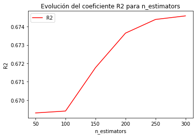
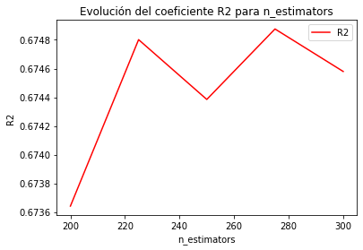
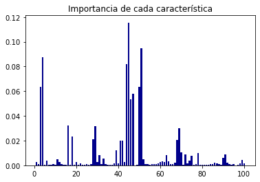

# Random Forest

En el modelo Random Forest se construyen construye n_estimators árboles de decisión usando la totalidad de la muestra para la construcción de cada uno, pero sólo un subconjunto de las caracterı́sticas para disminuir la correlación entre los árboles. Vamos a usar, tal y como se vió en teoría,  la raı́z cuadrada del número de caracterı́sticas, ya que la propia función de sklearn lo recomienda y porque empíricamente se sabe que esa cantidad da unos buenos resultados. Después de esto, se hace la media de los árboles obtenidos para evitar el overfitting y reducir la variabilidad.

Hemos optado por este modelo por su capacidad para lograr un bajo sesgo y una baja variabilidad (aunque para esto tendremos que usar regularización, como se explicará más adelante).

Los conjuntos de datos que usaremos serán los de entrenamiento estandarizados con y sin Outliers.

### Estimación de parámetros
 
 La función de `sklearn.ensemble` que usaremos es `RandomForestRegressor`, y como podemos observar esta función dispone de múltiples hiperparámetros para modificar (profundidad máxima de cada árbol, máximo número de
nodos terminales, mı́nimo número de muestras en cada nodo, . . .) pero de todos estos hiperparámetros sólo nos centraremos en uno: **n_estimators**. Éste nos permite controlar el número de árboles que usaremos para entrenar los datos. El resto de estimadores los tomamos por defecto.

En primer lugar, probamos a usar los datos de entrenamiento estandarizados con y sin Outliers, obteniendo un mejor error de validación cruzada en los datos con Outliers (0.6317213836930409 frente a 0.6745798117492704), por lo que a partir de ahora serán los que usemos para afinar el modelo.

Para elegir un valor de *n_estimators*, representamos el coeficiente de determinación $R^2$ usando validación cruzada con diferentes valores de éste parámetro entre 50 y 300, obteniendo los siguientes resultados   

-------------------------------------------------


-------------------------------------------------


Mejores parámetros:  {'max_features': 'sqrt', 'n_estimators': 300}

Con una $R^2$ de:  0.6317213836930409 

Table: Tabla de parámetros usados

|Parámetros | $R^2$ medio | Desviación tipica $R^2$| Ranking | tiempo medio ajuste |      
|---|---|---|---|---|    
| max_features sqrt n_estimators 300 | 0.6317 | 0.0129 | 1 | 2.2426|     
| max_features sqrt n_estimators 150 | 0.6307 | 0.0121 | 2 | 1.2035|     
| max_features sqrt n_estimators 250 | 0.6307 | 0.0130 | 3 | 2.0007|     
| max_features sqrt n_estimators 200 | 0.6298 | 0.0122 | 4 | 1.6041|     
| max_features sqrt n_estimators 100 | 0.6288 | 0.0116 | 5 | 0.7928|     
| max_features sqrt n_estimators 50 | 0.6248 | 0.0118 | 6 | 0.4569| 

Observamos que $R^2$ es creciente a medida que aumentan los árboles del bosque, pero dicho aumento conlleva también un mayor coste computacional, y es por eso que nos preguntamos si merece la pena usar un número muy elevado de árboles. Además como podemos ver en el gráfico anterior, entre 200 y 300 parece que la curva crece mucho más lentamente, por eso vamos a tomar nuevas mediciones entre 200 y 300 de 25 en 25 obteniendo lo siguiente: 

-------------------------------------------------


-------------------------------------------------

Mejores parámetros:  {'max_features': 'sqrt', 'n_estimators': 275}

Con una $R^2$ de:  0.6748757239989758 

Table: Tabla de parámetros usados

|Parámetros | $R^2$ medio | Desviación tipica $R^2$| Ranking | tiempo medio ajuste |      
|---|---|---|---|---|    
| max_features sqrt n_estimators 275 | 0.6749 | 0.0197 | 1 | 2.6051|     
| max_features sqrt n_estimators 225 | 0.6748 | 0.0204 | 2 | 1.8878|     
| max_features sqrt n_estimators 300 | 0.6746 | 0.0200 | 3 | 2.3295|     
| max_features sqrt n_estimators 250 | 0.6744 | 0.0196 | 4 | 2.1491|     
| max_features sqrt n_estimators 200 | 0.6736 | 0.0194 | 5 | 1.6467|


Dónde vimos que parece que se alcanza el máximo entorno a 260-290 árboles. Ası́, decidimos que el valor óptimo estarı́a dentro de
este intervalo y repetimos ahı́ el experimento con un salto de 5 árboles en cada iteración como podemos ver aquí: 


-------------------------------------------------


-------------------------------------------------

Mejores parámetros:  {'max_features': 'sqrt', 'n_estimators': 290}

Con una $R^2$ de:  0.6748993027349519 

Table: Tabla de parámetros usados

|Parámetros | $R^2$ medio | Desviación tipica $R^2$| Ranking | tiempo medio ajuste |      
|---|---|---|---|---|    
| max_features sqrt n_estimators 290 | 0.6749 | 0.0198 | 1 | 1.9222|     
| max_features sqrt n_estimators 280 | 0.6749 | 0.0196 | 2 | 2.3503|     
| max_features sqrt n_estimators 275 | 0.6749 | 0.0197 | 3 | 2.4055|     
| max_features sqrt n_estimators 285 | 0.6747 | 0.0196 | 4 | 2.4256|     
| max_features sqrt n_estimators 260 | 0.6746 | 0.0197 | 5 | 2.1476|     
| max_features sqrt n_estimators 265 | 0.6746 | 0.0195 | 6 | 2.3622|     
| max_features sqrt n_estimators 270 | 0.6745 | 0.0197 | 7 | 2.5613|


Obtuvimos el valor máximo con 290 árboles, y finalmente para afinar un poco más, se repitió por última vez el experimento entre 280 y 290 con saltos de 2 en 2: 


-------------------------------------------------


-------------------------------------------------

Mejores parámetros:  {'max_features': 'sqrt', 'n_estimators': 290}

Con una $R^2$ de:  0.6748993027349519 

Table: Tabla de parámetros usados

|Parámetros | $R^2$ medio | Desviación tipica $R^2$| Ranking | tiempo medio ajuste |      
|---|---|---|---|---|    
| max_features sqrt n_estimators 290 | 0.6749 | 0.0198 | 1 | 1.9802|     
| max_features sqrt n_estimators 280 | 0.6749 | 0.0196 | 2 | 2.3991|     
| max_features sqrt n_estimators 282 | 0.6748 | 0.0195 | 3 | 2.4906|     
| max_features sqrt n_estimators 288 | 0.6747 | 0.0197 | 4 | 2.4111|     
| max_features sqrt n_estimators 286 | 0.6747 | 0.0197 | 5 | 2.4811|     
| max_features sqrt n_estimators 284 | 0.6746 | 0.0197 | 6 | 2.7908|


Al ver que de nuevo el máximo era 290 decidimos establecer ese valor para *n_estimators*.


A continuación medimos el coeficiente $R^2$ sobre el conjunto de train, obteniendo 0.9531783709010848. Esto nos hace pensar que el modelo
sobreajusta e intentamos regularizar para reducir la complejidad (el número de nodos) de cada árbol penalizando con el parámetro **ccp_alpha**.

El valor por defecto de *ccp_alpha* es 0 y para probarlo hemos dividido el conjunto de Train en dos, un 80% para probar diversos valores de *ccp_alpha* y el otro 20% como conjunto de validación, para ver cómo afecta la regularización al error de validación. 

Variaremos el alfa entre 0.0001 y 0.001 con saltos de 0.0001 unidades en cada iteración. Los resultados obtenidos son los siguientes: 

-------------------------------------------------


-------------------------------------------------

Como podemos observar, la regularización reduce considerablemente el sobreajuste sobre los datos de entrenamiento y en cambio el error de validación apenas se reduce, por lo que consideramos como valor el  *ccp_alpha*=0.0006, ya que consideramos que consigue un buen comportamiento tanto en el conjunto de entrenamiento como en validación. 

```
 alpha= 0.0006000000000000001
------------------------------------------------------------
 Evaluando Random Forest
------------------------------------------------------------
E_in en entrenamiento:  0.7070096167353577
E_val en validación:  0.6489352273229924
```

Así los resultados finales sobre entrenamiento y test con el modelo serían:

```
------------------------------------------------------------
 Evaluando Random Forest
------------------------------------------------------------
E_in en entrenamiento:  0.6944214297507898
E_test en test:  0.6126615255453305
```

Finalmente, comentar los atributos que tienen más importancia en el árbol de decisión que hemos obtenido: 

-------------------------------------------------


-------------------------------------------------

Dónde podemos apreciar que los atributos más importantes serían los que ocupan la posición 44,49 y 3 en orden de mayor a menor.


## Función Pérdida y Regularización 

La función de pérdida que intenta minimizar cada uno de los árboles de decisión que promedia random forest es:

$$R(T)=\sum_{m=1}^{|T|} N_m Q_m(T) + \alpha|T|$$

Veamos qué significa cada elemento: $|T|$ es el número de nodos del árbol $T$, $N_m$ es el número de instancias que caen en el nodo terminal $m$, $\alpha$
el coeficiente que penaliza la complejidad del árbol (para regularizar) y $Q_m(T)$ la medida de impureza del nodo terminal m. 

Como medida de impureza, tomamos Gini Index, que es la siguiente: 

$$Q_m(T)=\sum_{k=1}^{K} p_{mk}(1-p_{mk})$$

dónde $p_{mk}$ es la proporción de la clase k en el nodo m.

Dado que nosotros usaremos una regularización con $alpha=0.0006$ nuestra función a minimizar será:

$$R(T)=\sum_{m=1}^{|T|} N_m Q_m(T) + 0.0006|T|$$


